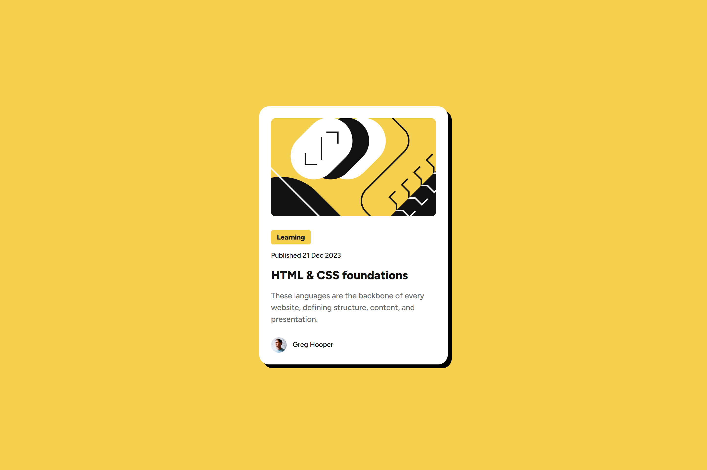

# Frontend Mentor - Blog preview card solution

This is a solution to the [Blog preview card challenge on Frontend Mentor](https://www.frontendmentor.io/challenges/blog-preview-card-ckPaj01IcS). Frontend Mentor challenges help you improve your coding skills by building realistic projects. 

## Table of contents

- [Overview](#overview)
  - [The challenge](#the-challenge)
  - [Screenshot](#screenshot)
  - [Links](#links)
- [My process](#my-process)
  - [Built with](#built-with)
  - [What I learned](#what-i-learned)
  - [Useful resources](#useful-resources)
- [Author](#author)

**Note: Delete this note and update the table of contents based on what sections you keep.**

## Overview

### The challenge

Users should be able to:

- See hover and focus states for all interactive elements on the page

### Screenshot

### Links

- Solution URL: [My Repo](https://github.com/Ghozy165/Blog-preview-card)
- Live Site URL: [My Live Solution](https://blog-preview-card-tau-ten.vercel.app)

## My process

### Built with

- Semantic HTML5 markup
- CSS custom properties
- Flexbox
- Mobile-first workflow

### What I learned

I think most important think I learned is to code the Frontend following web design that has been provided, it more efficient. If coding Frontend without design (Figma or eq) first it takes more time to IMAGINE, TESTING, and FIX. But with design first, the IMAGINE in the designing part, and coding Frontend would be smoother with less testing. Of course if there is no Error syntax or Logic :V.

### Useful resources

- [Design File ](https://www.frontendmentor.io/articles/figma-for-developers-how-to-work-with-a-design-file-m6CZKZ1rC1) - This is an amazing article which helped me finally understand Design file in figma.

## Author

- Frontend Mentor - [@Ghozy165](https://www.frontendmentor.io/profile/Ghozy165)
